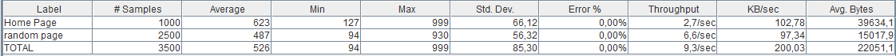
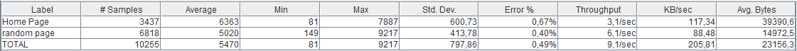
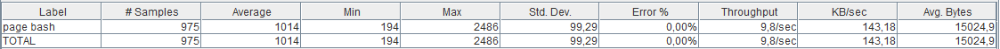
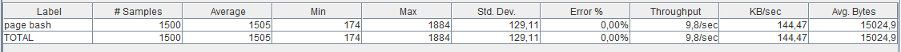
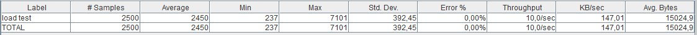
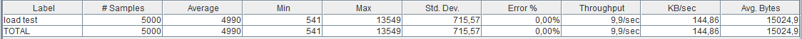

## Verslag Loadtesting: Simple LAMP

### Hardware specificaties LAMP server:

* 3 GB RAM
* 1 CPU

### Loadtest 1: Average load

###### Test scenario
* 5 users
* isit home page -> 2 random pages-> Home page -> 3 random pages

###### Resultaat

### Loadtest 2: High load

###### Test Scenario
* 25 users
* Visit home page -> 2 random pages-> Home page -> 3 random pages

###### Resultaat

### Loadtest 3: Page bash

###### Test scenario 1
* 10 users per second
* Visit only the home page
 
###### Resultaat

###### Test scenario 2
* 15 users per second
* Visit only the home page

###### Resultaat

###### Test scenario 3
* 25 users per second
* Visit only the home page

###### Resultaat

###### Test scenario 4
* 50 users per second
* Visit only the home page

###### Resultaat

### Loadtest 4: Crash test

