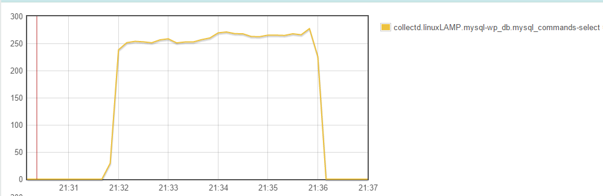

## Verslag Loadtesting: Simple LAMP

### Hardware specificaties LAMP server:

* 3 GB RAM
* 1 CPU

### Loadtest 1: Average load

#### Test scenario
* 5 users per seconde
* Visit home page -> 2 random pages-> Home page -> 3 random pages

###### Resultaat

### Loadtest 2: High load

#### Test Scenario
* 25 users per seconde
* Visit home page -> 2 random pages-> Home page -> 3 random pages

###### Resultaat

### Loadtest 3: Page bash

#### Test scenario 1
* 10 users per second
* Visit only the home page
 
###### Resultaat

#### Test scenario 2
* 15 users per second
* Visit only the home page

###### Resultaat

#### Test scenario 3
* 25 users per second
* Visit only the home page

###### Resultaat

###### CPU

###### Memory

###### MySql database

#### Test scenario 4
* 50 users per second
* Visit only the home page

###### Resultaat

###### CPU

###### Memory

###### MySql database

### Loadtest 4: Crash test

#### Test Scenario
* Vanaf 50 tot 150 users per seconde
* Visit only the home page
* Uitzoeken wanneer de server zou crashen
 
###### Resultaat

###### CPU
.PNG)
###### Memory
.PNG)
###### MySql database
.PNG)
