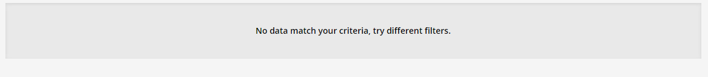

# Voortgangsrapport week 04

* Groep:02
* Datum: 16/10/15

| Student  | Aanw. | Opmerking |
| :---     | :---  | :---      |
| Bram Martens |       |           |
| Dennis Verfaillie |       |           |
| Tomas Vercautter |       |           |
| Toon Lamberigts |       |           |

## Wat heb je deze week gerealiseerd?

### Algemeen

####Huboard

####Burndown

#####chart

#####data

####Toggle

### Bram Martens

### Dennis Verfaillie

### Tomas Vercautter

### Toon Lamberigts

## Wat plan je volgende week te doen?

### Algemeen
### Bram Martens
### Dennis Verfaillie
### Tomas Vercautter
### Toon Lamberigts

## Waar hebben jullie nog problemen mee?

* ...
* ...

## Feedback technisch luik

### Algemeen

* README.md:
    * Link naar huboard en tijdregistratie toevoegen
* Linux:
    * Vagrant-omgeving hoort in subdirectory, niet in de root van jullie project!
    * Er is een taak nodig: selecteren van een test tool
* Neerslag deelopdrachten?
    * lastenboek: opdeling in deeltaken, toewijzen verantwoordelijken (= voorbereiding Kanban-bord)
    * testplan/-rapport?
    * niets terug te vinden over Windows
        * wie heeft welk boek gelezen?
        * Neerslag verwerking: samenvattingen, cheat sheets, 
* Weekrapporten
    * In W1 was eerste samenkomst -> nog geen rapport nodig (was ook niet ingevuld)
    * Vervang in sjabloon (en ook in dit rapport) "studentx" door jullie namen!
    * Rapporten voor W2-3? Meteen ook voor W4!
    * Wekelijkse overzichten tijdregistratie!
* Kanban-bord (Huboard)
    * Goed: nieuwe kolommen Current Sprint en Ready for Testing. Zet afspraken ivm gebruik hiervan in README.md
        * Wat als iemand bezig is met testen? Evt. kolom naar "Testing" hernoemen en "Ready for testing" aanduiden in de kolom "Working" met "Ready for next stage" in het detailvenster van de issue.
      * Tickets in Ready en verder moeten een Assignee hebben (wie verantwoordelijkheid opneemt voor de uitvoering)
      * Enkel begeleiders markeren als Done. Evt. in kolom "Ready for testing" markeren als "Ready for next stage"
      * Nog niets voor Windows gedaan? Enkel één taak "Powershell boek lezen" . Elk teamlid moet een boek lezen, dus voor elk teamlid een taak (met vermelding titel!)

Verwerk nieuwe issues en die door mij op "Blocked" gezet.

### Algemeen
### Bram Martens
### Dennis Verfaillie
### Tomas Vercautter
### Toon Lamberigts

