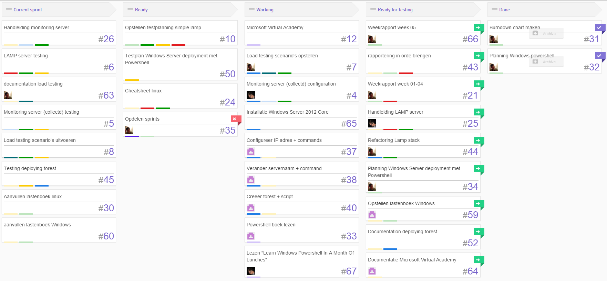
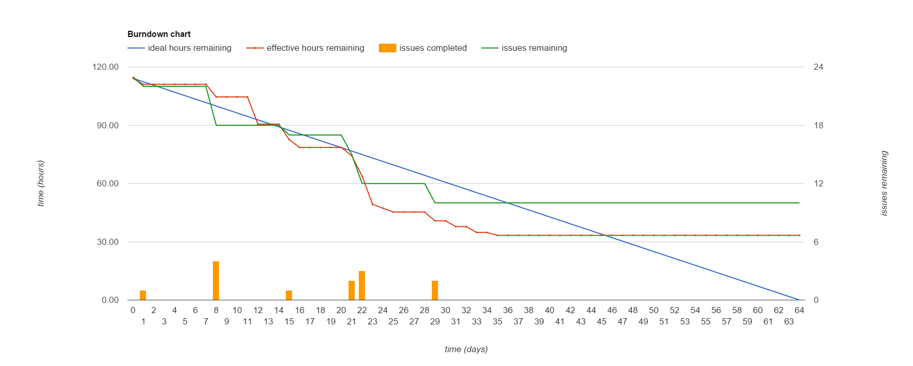
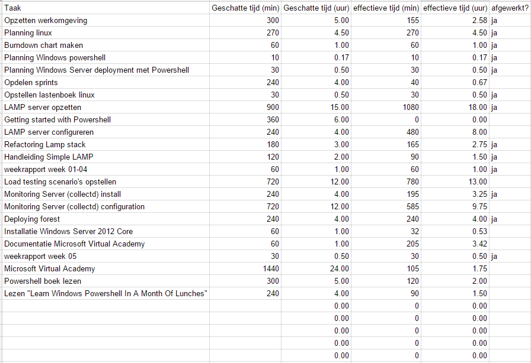
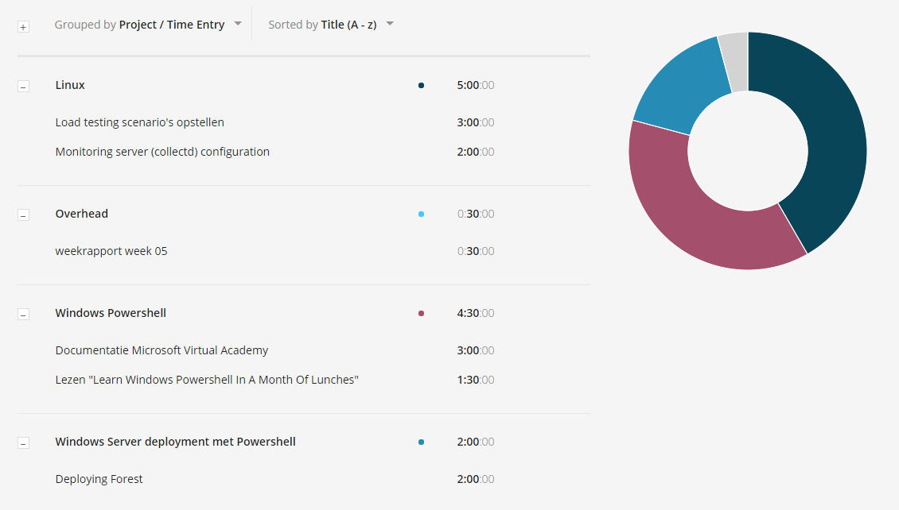
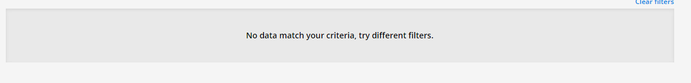
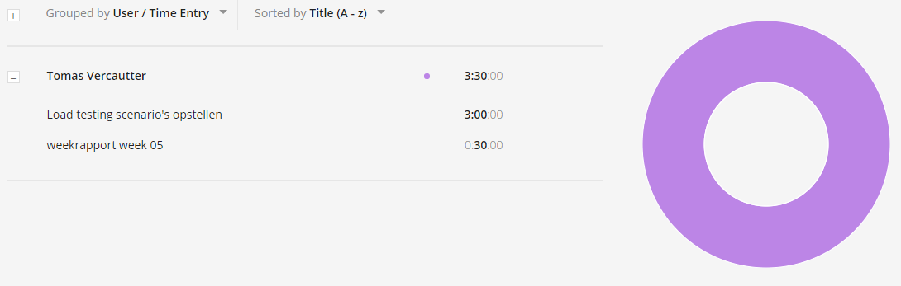
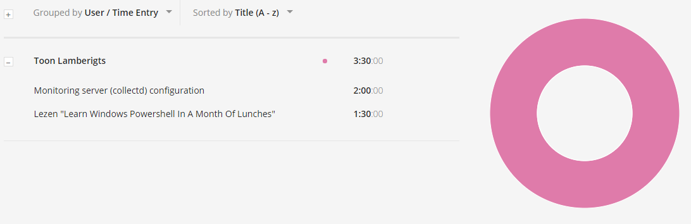

# Voortgangsrapport week 06

* Groep:02
* Datum: 30/10/15

| Student  | Aanw. | Opmerking |
| :---     | :---  | :---      |
| Bram Martens |       |           |
| Dennis Verfaillie |       |           |
| Tomas Vercautter |       |           |
| Toon Lamberigts |       |           |

## Wat heb je deze week gerealiseerd?

### Algemeen

####Huboard

####Burndown

#####chart

#####data

####Toggle

### Bram Martens

### Dennis Verfaillie

### Tomas Vercautter

### Toon Lamberigts

## Wat plan je volgende week te doen?

### Algemeen
### Bram Martens
* boek windows powershell
* documentatie windows powershell
* lamp server testing

### Dennis Verfaillie 
* boek windows powershell
* documentatie windows powershell 
* deployment ws2012

### Tomas Vercautter
* opstellen load testing scripts
* testplanning simple lamp
* boek windows powershell

### Toon Lamberigts
* boek windows powershell
* documentatie windows powershell
* monitoring server
* handleiding monitoring server

## Waar hebben jullie nog problemen mee?

## Feedback technisch luik

### Algemeen
* Kanban bord en toggle:
    * Noteer in de tickets en tijdsregistratie welke hoofdstukken je doornam. De beschrijving is te algemeen. 
* Windows:
    * Wake up call! Samenvatting stelt nog niet veel voor. Cheatsheet is er niet.Script zijn ook niet aanwezig. Van een team bestaande uit 4 leden verwacht ik veel meer na 5 weken. Ik verwacht dringend meer inhoud.  
    * Maak een samenvatting van de boeken. Vul dit aan terwijl je het boek leest. Werk hiervoor samen in één document. Uiteindelijk zal dit tijdswinst opleveren. Maak hiervoor duideljke afspraken tijdens de sprint meetings. Hoe wordt de kwaliteit van het document gewaarborgd? Schrijf een duidelijk testplan en maak hiervoor tickets aan.
    * Document cheatsheat: Elk teamlid vult tijdens het doornemen van de leerstof (boek/virtual academy) het document aan met de geleerde commando's. Maak hiervoor duidelijk afspraken rond de onderverdeling van het document in hoofdstukken (bvb verschillend document per hoofdstuk), de onderlingen samenwerking en de kwaliteitsgarantie.
    * Na 5 weken bijna geen scripts aanwezig in de scripts folder.  Alle scripts die je gebruikt of leert uit het boek of de online opleiding hou je bij. Zorg voor een duidelijke structuur.

### Algemeen
### Bram Martens
### Dennis Verfaillie
### Tomas Vercautter
### Toon Lamberigts

