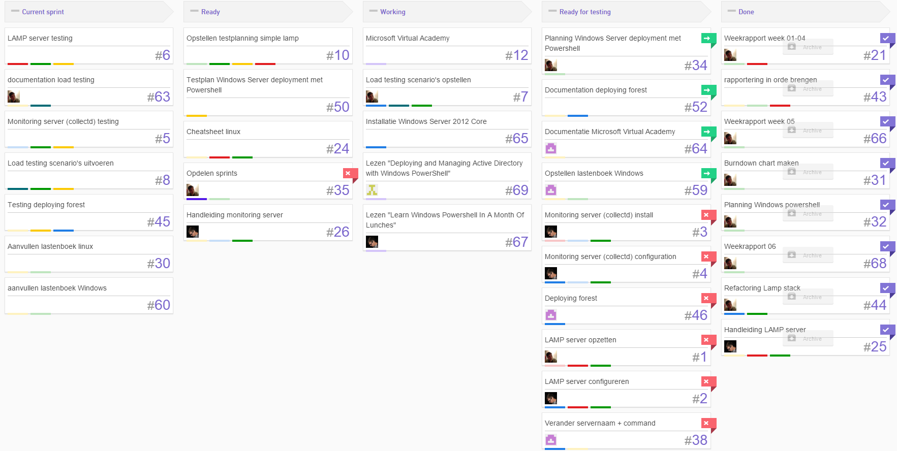
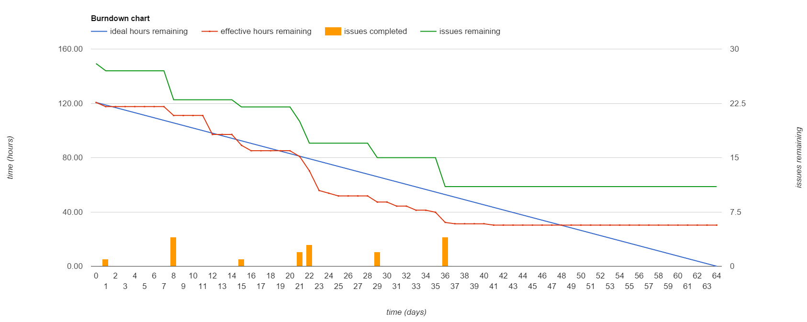
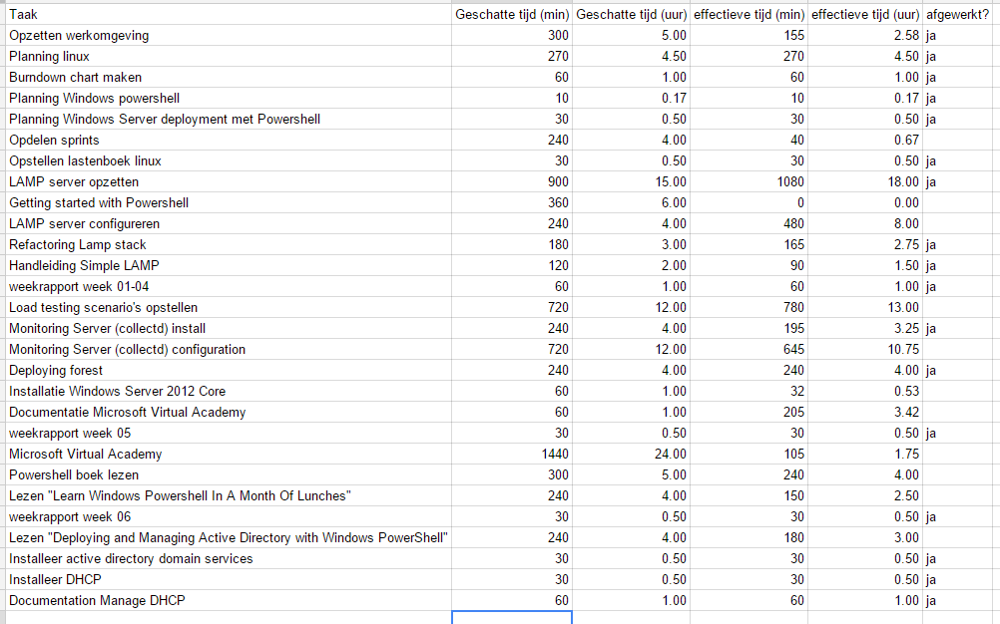
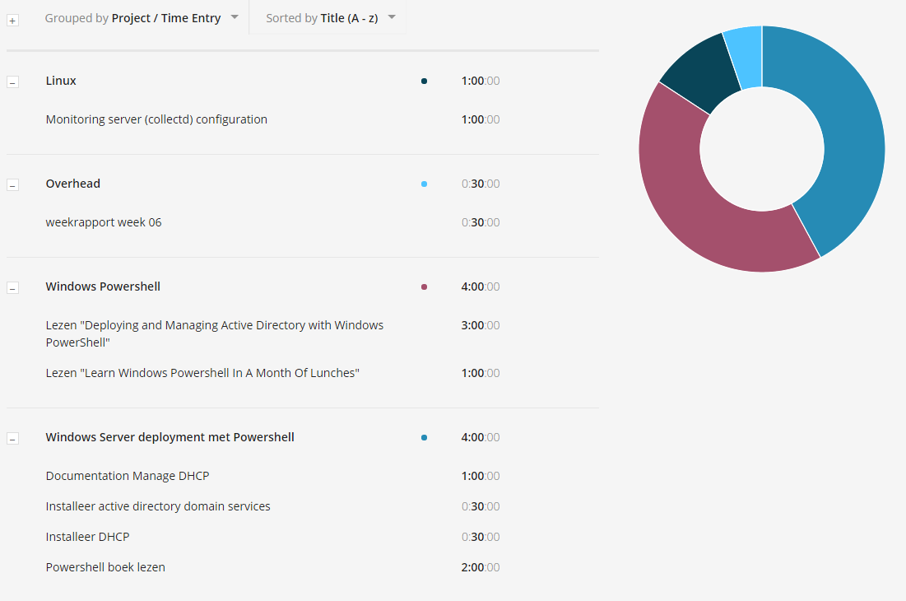
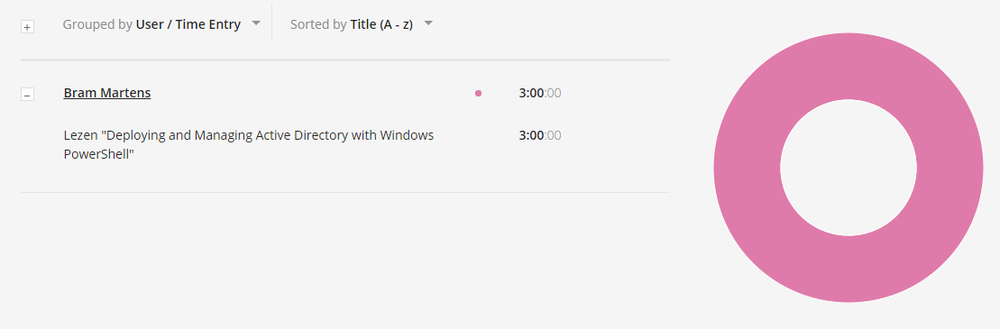
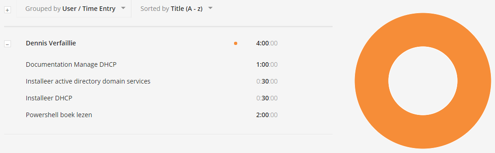
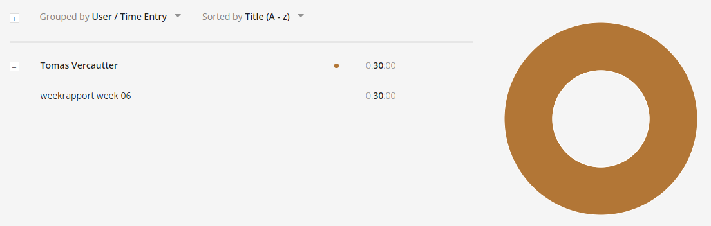
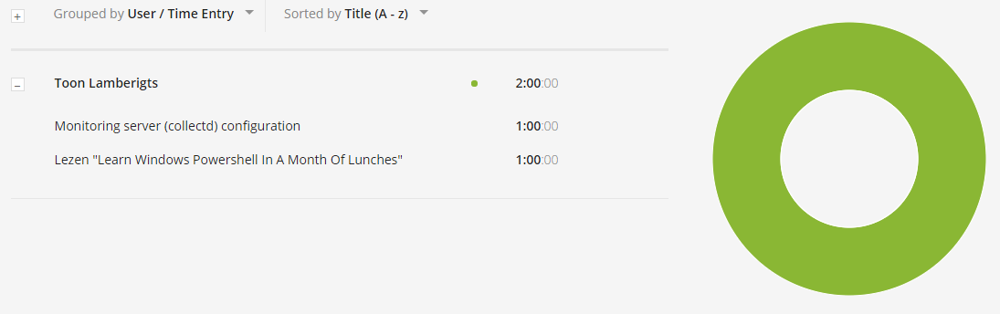

# Voortgangsrapport week 07

* Groep:02
* Datum: 6/11/15

| Student  | Aanw. | Opmerking |
| :---     | :---  | :---      |
| Bram Martens |       |           |
| Dennis Verfaillie |       |           |
| Tomas Vercautter |       |           |
| Toon Lamberigts |       |           |

## Wat heb je deze week gerealiseerd?

### Algemeen

####Huboard

####Burndown

#####chart

#####data

####Toggle

### Bram Martens

### Dennis Verfaillie

### Tomas Vercautter

### Toon Lamberigts

## Wat plan je volgende week te doen?

### Algemeen
### Bram Martens
* boek windows powershell
* documentatie windows powershell
* lamp server testing

### Dennis Verfaillie 
* boek windows powershell
* documentatie windows powershell 
* deployment ws2012

### Tomas Vercautter
* opstellen load testing scripts
* testplanning simple lamp
* boek windows powershell

### Toon Lamberigts
* boek windows powershell
* documentatie windows powershell
* handleiding monitoring server

## Waar hebben jullie nog problemen mee?

## Feedback technisch luik

### Algemeen

### Bram Martens
### Dennis Verfaillie
### Tomas Vercautter
### Toon Lamberigts

