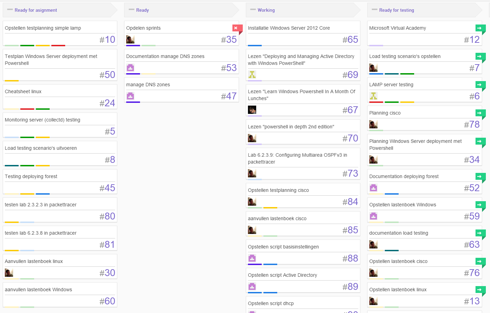
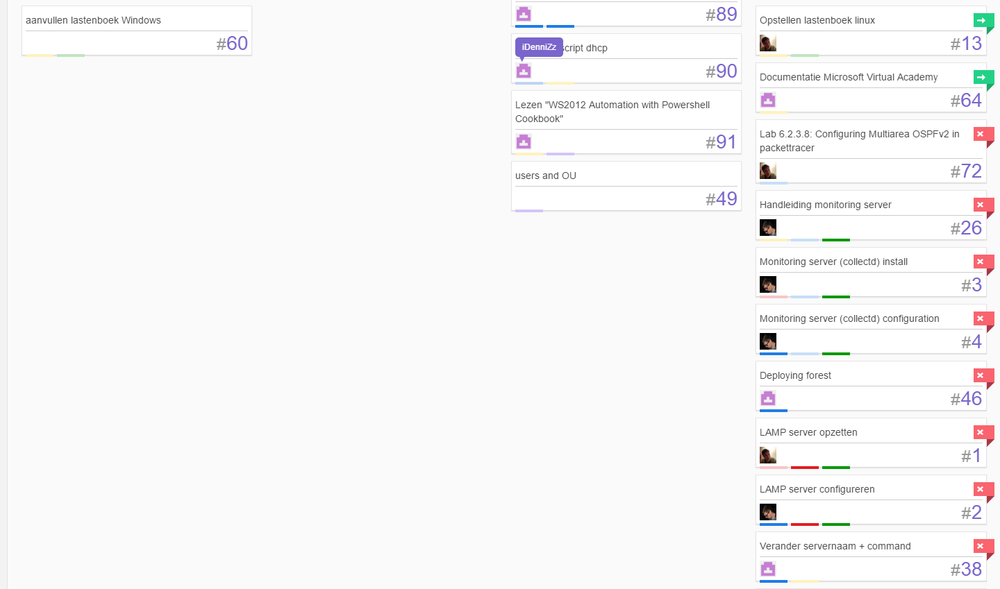
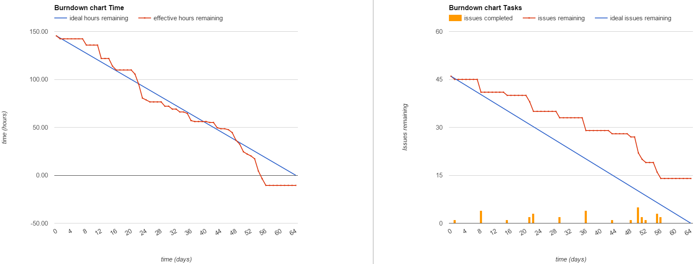
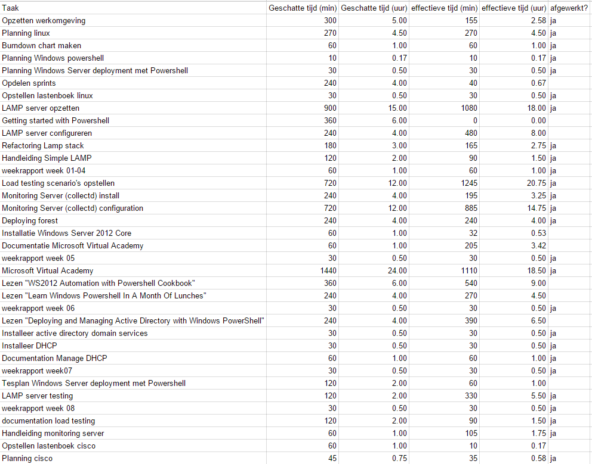
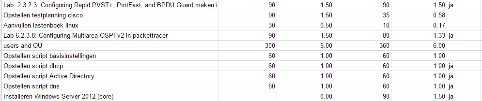
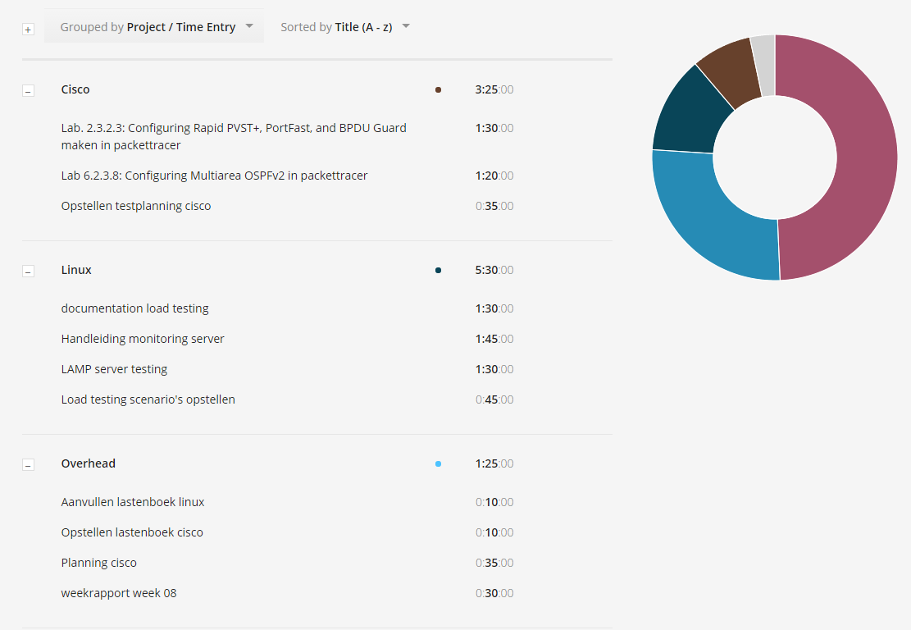
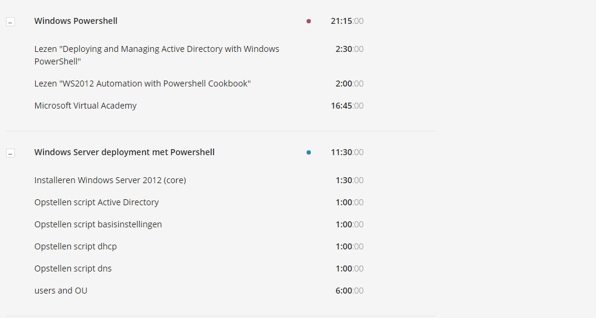
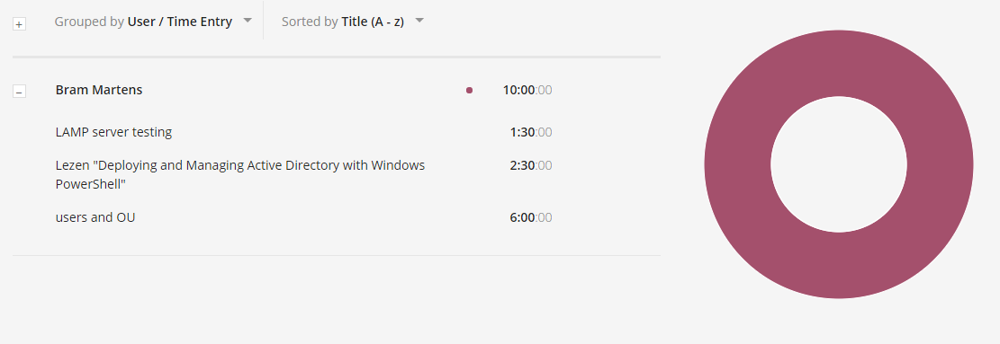
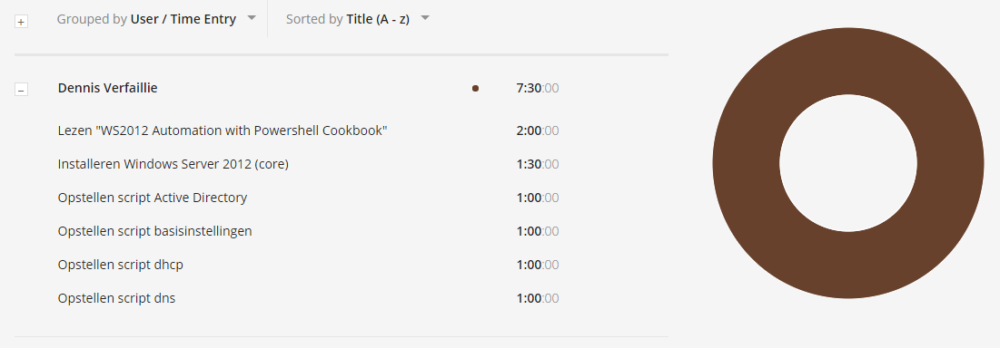
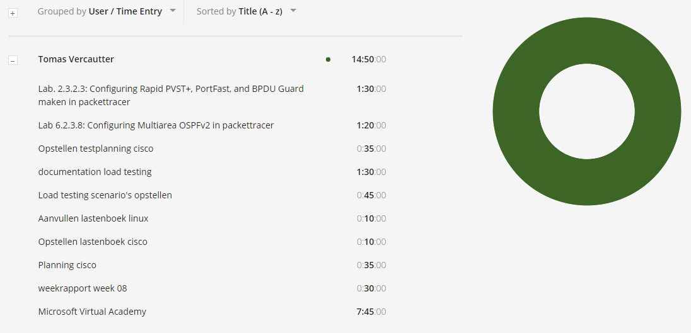

# Voortgangsrapport week 09

* Groep:02
* Datum: 20/11/15

| Student  | Aanw. | Opmerking |
| :---     | :---  | :---      |
| Bram Martens |       |           |
| Dennis Verfaillie |       |           |
| Tomas Vercautter |       |           |
| Toon Lamberigts |       |           |

## Wat heb je deze week gerealiseerd?

### Algemeen

####Huboard

####Burndown

#####chart

#####data

####Toggle

### Bram Martens

### Dennis Verfaillie

### Tomas Vercautter

### Toon Lamberigts

## Wat plan je volgende week te doen?

### Algemeen
### Bram Martens
* boek windows powershell

### Dennis Verfaillie 
* boek windows powershell
 
* deployment ws2012

### Tomas Vercautter
* boek windows powershell
* packettracer

### Toon Lamberigts
* boek windows powershell
* testing monitoring server
* packettracer
* opzetten multi-tier omgeving

## Waar hebben jullie nog problemen mee?

## Feedback technisch luik

### Algemeen

### Bram Martens
### Dennis Verfaillie
### Tomas Vercautter
### Toon Lamberigts

